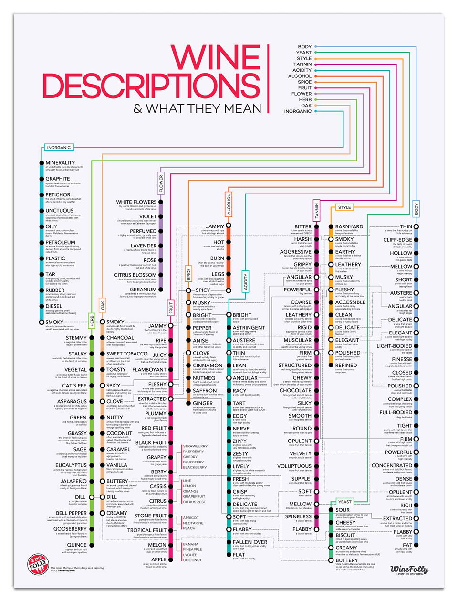

  

# Tianheng (Jady) Hu
 
I'm Jady, a second year MPH student in Biostatistics at Columbia University Mailman School of Public Health. My professional interests include data science, clinical trial methodology and health policy management. My favorite wine is called Josh and wine type is rose.

  

#  Veru Xu

ABOUT

  

# Helen Zhang

My name is Helen and I'm in the Epidemiology Department with a certificate in CEOR. Prior to graduate school, I received my BS in Microbiology from University of Wisconsin-Madison. My professional interests are real-world data and outcomes research. 

  

# Yuanxin (Yolanda) Zhang

ABOUT

  