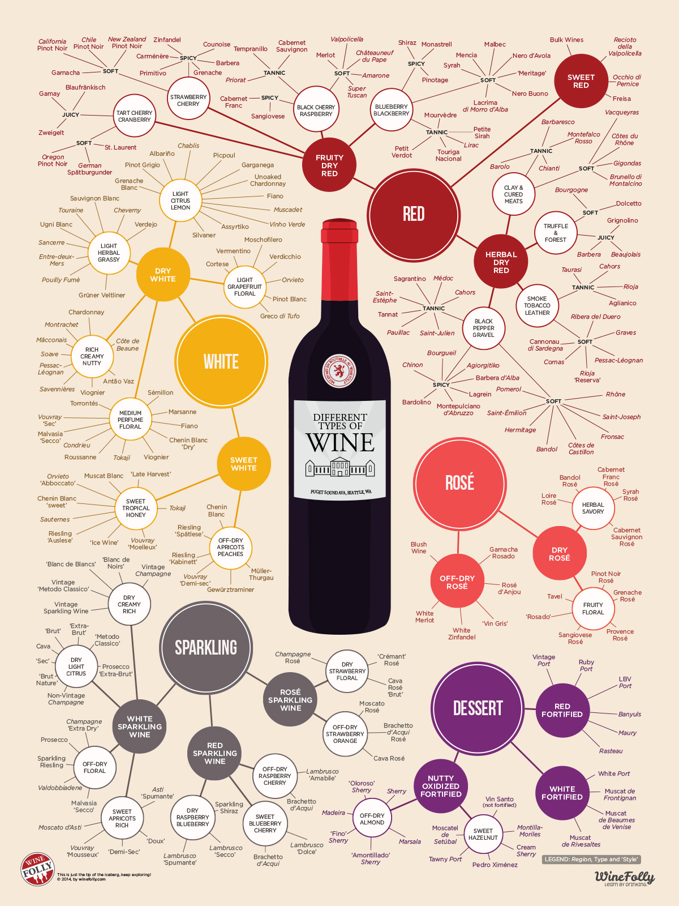
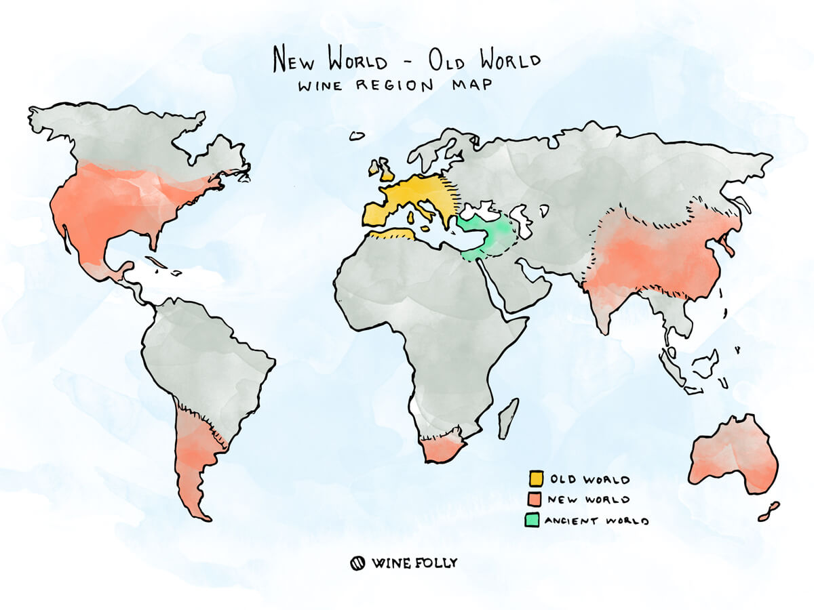

  

## Dataset

The data for this project is downloaded from [Kaggle](https://www.kaggle.com/zynicide/wine-reviews). It was scraped on November 22nd, 2017 from the [Wine Enthusiast Rating ](https://www.winemag.com/?s=&drink_type=wine) database. Wine Enthusiast is a magazine provide information on wine quality, wine variety, tours and events—in short - everything about wine. 

This dataset contains 130k wine reviews with variety, location, winery, price, description and reviewer information. There is much information on description and title on each wine. We had extracted from the text of useful information such as the year the wine was made in and the characteristics of the taste. 

At first, the dataset contains more than 50 wine varieties and it is hard to get useful information. Therefore, we had categorized all varieties to four types of wine: red, white, rose and sparkling according to the following infographics on [Wine Folly](https://winefolly.com/deep-dive/different-types-of-wine/).

  

<h6 style="text-align: center;" markdown="1"></h6>

  

## Capturing Wine Vintage

Year, also known as wine vintage, is the year when the grapes were harvested. This piece information is crucial for a bottle of wine, as the year of harvest greatly affects the taste and quality of a bottle of wine. Since the information is not ready to use in the raw dataset, we used a function to extract year information from the wine name. We later examined the change of price and rating over time.

<h6 style="text-align: center;" markdown="1"></h6>

  

## Old vs New World

Wines are also categorized by new and old world, based on region of origin (Wine History 101 Time). The general distribution is shown below. 

<h6 style="text-align: center;" markdown="1"></h6>

We also categorized our wine dataset using country list from [Wine Folly](https://winefolly.com/deep-dive/new-world-vs-old-world-wine/). The "world of origin" categorical variable is a 3-level variable, and coded into two dummy variables (old world, new world). We will examine the characteristic difference and rating difference between old and new world wines in later analyses.

