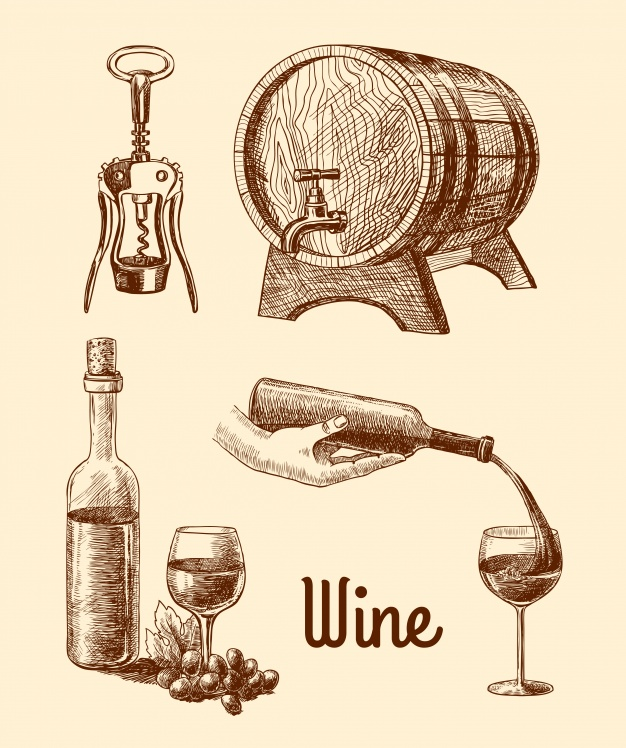

<h6 style="text-align: center;" markdown="1">Vera Xu (yx2578) | Tianheng Hu (th2533) | Helen Zhang (hlz2108) | Yuanxin Zhang (yz3736)</h6>

  

<h6 style="text-align: center;" markdown="1"></h6>
(Wordcloud)

(screencast)

## Introduction

With wine consumption in the U.S. at an all-time high, there are a huge amount of varieties of wine on the market. Consumers are more eager to learn about how to pick a good wine. There are many review systems online such as Vinno, Wine Enthusiasts. It is important for the consumers to learn what is behind those ratings. This data offers us a great opportunity to explore what factors are associated with wine ratings. We hope to conduct regression analysis of the wine rating and price based on location/grape type/notes/region to see if there are significant differences among these factors.The regression model would help customers estimate and predict wine rating with a series of wine characteristics. We also want to provide people with a interactive website to visualize wine ratings and prices. 

## Dataset

The data for this project is downloaded from [Kaggle](https://www.kaggle.com/zynicide/wine-reviews). It was scraped on November 22nd, 2017 from the [WineEnthusiast Rating database](https://www.winemag.com/?s=&drink_type=wine). Wine Enthusiast is a magazine provide information on wine quality, wine variety, tours and events—in short - everything about wine. 

This dataset contains 130k wine reviews with variety, location, winery, price, description and reviewer information. There is much information on description and title on each wine. We had extracted from the text of useful information such as the year the wine was made in and the characteristics of the taste. 

At first, the dataset contains more than 50 wine varieties and it is hard to get useful information. Therefore, we had categorized all varieties to four types of wine: red, white, rose and sparkling according to the following infographics on [Wine Folly](https://winefolly.com/deep-dive/different-types-of-wine/).

  

## Fun facts
A quick summary of our findings include:

Data scraping of clinicaltrials.gov is difficult
Out of 10,000 trials prior to 2017, only 39 met our criteria for calculating the fragility index.
California has by far the most number of clinical trials out of available data
For detailed results, analysis and output, please refer to our report.

