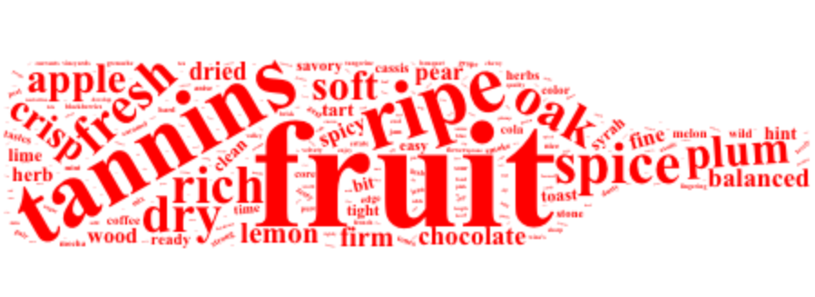

---
title:
output: 
  html_document:
    toc: false
    toc_float: false
---

 

<h1 style="text-align: center;" markdown="1">What's Behind Great Wines?</h1>

 

<h4 style="text-align: center;" markdown="1">**Vera Xu (yx2578) | Tianheng Hu (th2533) | Helen Zhang (hlz2108) | Yuanxin Zhang (yz3736)**</h1>

 

Wine is one of the most common alcoholic drinks around the world and there is a tremendous amount of knowledge about wine history, wine categories, and what characterizes a great bottle of wine.

This dataset offers us an excellent opportunity to explore what factors are associated with wine ratings. We hope to first explore the relationship between wine prices and trends in rating over time using exploratory graphs. We also hope to identify the keywords of each type of wine using the word clouds. We will also use an interactive map to better demonstrate the geographic distribution of wine.

In addition, we hope to conduct regression analyses of the wine rating and price to better capture the relationship between wine rating and prices. The regression models would help customers estimate and predict wine rating with a series of wine characteristics.

<h6 style="text-align: center;" markdown="1"></h6>

 

## Fun Facts

 

* 2002 was the year of highest average wine price for sparkling wine - above $100!

* 2004 was the year of highest average wine price for white wine - above $50!

* England was the country of highest wine rating overall - average rating was 92/100.

* Words appeared most frequently for red wine, white wine, rose wine and sparkling wine are fruit, acidity, acidity, and apple, respectively.

* Relationship between wine price and rating are segmented - see details in [regression analyses](regression.html)!

