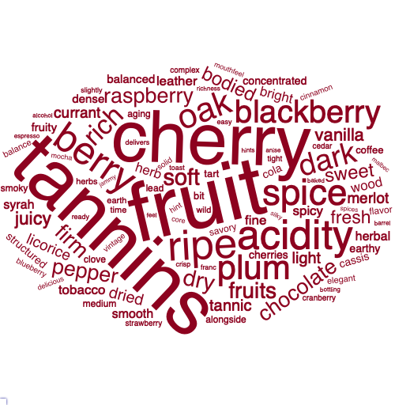
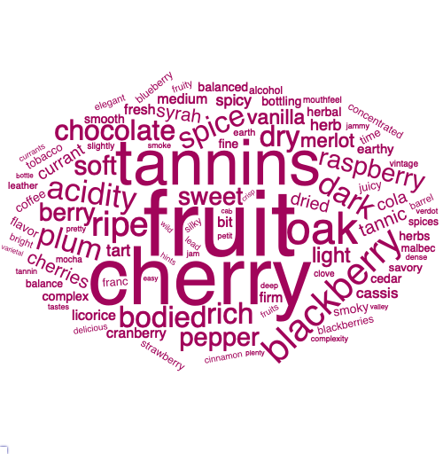
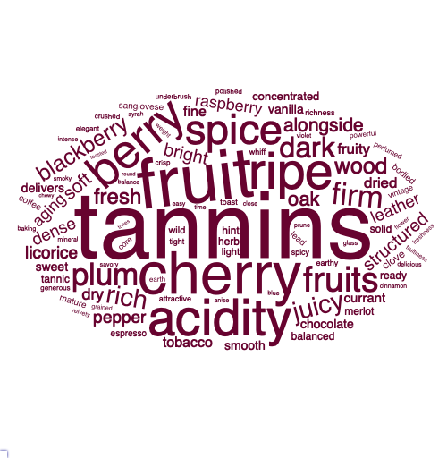
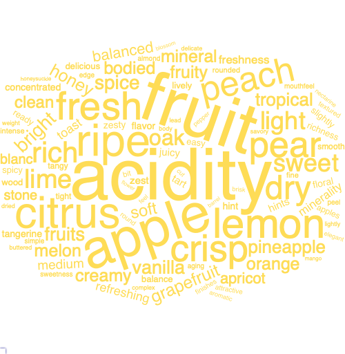
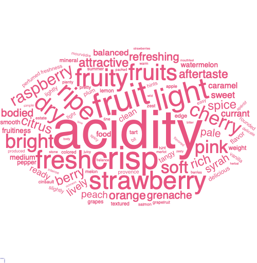
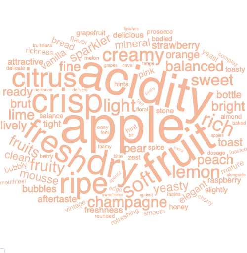

<br>

**Vera Xu (yx2578) | Tianheng Hu (th2533) | Helen Zhang (hlz2108) | Yuanxin Zhang (yz3736)**

<br>


```{r, echo = FALSE, message = FALSE, warning = FALSE}
library(tidyverse)
library(leaflet)
library(ggplot2)
library(plotly)
library(readxl)
library(modelr)
library(mgcv)
```

# Motivation

Wine is one of the most common alcoholic drinks in the world and there is a tremendous amount of knowledge about wine history, wine categories, and what characterizes a great bottle of wine.

This dataset offers us an excellent opportunity to explore what factors are associated with wine ratings. We hope to begin by evaluating wine prices and rating trends using exploratory graphs. We also hope to identify keywords for each wine type using the word clouds. We will also use an interactive map to better demonstrate the geographic distribution of wine.

In addition, we plan to conduct regression analyses of wine rating and price to better capture the relationship between these two variables. We hope that the regression models would help customers estimate and predict wine ratings using a series of wine characteristics.


# Related work

Some interesting projects that inspired us can be found below:

* A [project](https://web.stanford.edu/~kjytay/courses/stats32-aut2019/projects/wine_report.html) that aims to analyze the same dataset to evaluate what characteristics of a wine affect its perceived quality, and what characteristics are correlated with each other

* A [project](http://rstudio-pubs-static.s3.amazonaws.com/496773_7fbdf1545d2e44048bbbfad374027b94.html) that examined Red Wine Quality using a red wine dataset from Kaggle.

# Initial questions

We are trying to answer several questions using exploratory analysis. 

To understand the information that customers could get from the ratings, price among different wine type and region, we want to answer the following questions:

1. What is the distribution of prices among the four types of wine? Is at least one wine type's price different from the others?

2. What is the distribution of ratings among the four types of wine? Is at least one wine type's rating different from the others?

3. What is the average price of wines from different regions? Which region has the highest average price wine?

4. What is the average rating of wines from different regions? Which region has the highest average rating?

5. What is the trend of price over time among the 4 types of wine? 

6. What is the trend of ratings over time among the 4 types of wine?

7. What is the average ratings by each tasters? Who rates the highest price wine? Who reviews the largest number of wines?

8. Which winery has the top average ratings wine? 

9. Are there any differences in prices between new world and old world wine?

10. Are there any differences in ratings between new world and old world wine?

11. What is the relationship between wine rating and wine prices?

12. What are the predictor variables that can be used to assess the quality of wine?

13. What is the worldwide distribution of wine quality and price using interactive demonstration?

13. What is the distribution of wine quality and price within US using interactive demonstration?

# Data

The data for this project is downloaded [here](https://www.kaggle.com/zynicide/wine-reviews). It was scraped on November 22nd, 2017 from the [WineEnthusiast Rating database](https://www.winemag.com/?s=&drink_type=wine). It contains 130k wine reviews with variety, location, winery, price, description, and reviewer information. 

We first imported the raw dataset, and created a **year extracting function**. This function was used to extract the wine vintage information from the wine name.

```{r extract_year_function, echo = FALSE, message = FALSE, warning = FALSE}
year_extract <- function(string) {
  t <- regmatches(string, regexec("[1][9][4-9][0-9]|[2][0-9][0-9][0-9]", string))
  sapply(t, function(x) {
    if (length(x) > 0) {
      return(as.numeric(x))
    } else {
      return(NA)    
    }
  })
}

wine_df = 
  read_csv(
  "./wine_data/winemag-data-130k-v2.csv") %>% 
  select(-region_2, -taster_twitter_handle, -X1) %>% 
  mutate(year = year_extract(title))
```

We also coded new variables for wines from **New vs Old World**. The new-world and old-world wines are categorized mainly by the country of origin. The detailed breakdown between new-world and old-world wines can be found [here](https://winefolly.com/deep-dive/new-world-vs-old-world-wine/.)

```{r, echo = FALSE, warning = FALSE, message = FALSE}
old_world_country = c("France", "Italy", "Portugal", "Spain", "Germany", "Hungary", "Croatia", "England")

new_world_country = c("US", "Canada", "Argentina", "Australia", "New Zealand", "South Africa", "China")

wine_df = 
  wine_df %>% 
  mutate(new_world = country %in% new_world_country,
         old_world = country %in% old_world_country)
```
```{r, echo = FALSE, message = FALSE, warning = FALSE}
wine_df = 
  read_csv(
  "./wine_data/tidy/wine_all.csv")
```

In terms of wine type, we separated wine types into four major types: **red, white, sparkling, and rose** based on the categorizing method from [Wine Folly](https://media.winefolly.com/Different-Types-of-Wine-v2.jpg). We did this by creating a excel sheet that matches all grape types with wine >200 to the four category, and then subset the data using the following code chunk:

```{r, echo = FALSE, warning = FALSE, message = FALSE}
wine_type = 
    read_xlsx(
  "./wine_data/wine type.xlsx")  

wine_df = 
  wine_df %>% 
  mutate(type = ifelse(variety %in% wine_type$red, "red", 
                       ifelse(variety %in% wine_type$white, "white", 
                              ifelse(variety %in% wine_type$sparkling, "sparkling", 
                                     ifelse(variety %in% wine_type$rose, "rose", NA )))))

red_df = 
  wine_df %>% 
    filter(!is.na(type),
           type == "red")
  
white_df = 
  wine_df %>% 
    filter(!is.na(type),
           type == "white")

sparkling_df = 
  wine_df %>% 
    filter(!is.na(type),
           type == "sparkling")

rose_df = 
  wine_df %>% 
    filter(!is.na(type),
           type == "rose")
```

## Variables

* **title**: wine name

* **price**: price in USD 

* **points**: rating score on a 100 scale     

* **taster_name**: the taster who rated the wine

* **country**: country of origin

* **province**：province of origin

* **winery**: winery name

* **description**: a paragraph to describe the wine tasting notes

* **variety**: grape type

* **type**: red, white, rose or sparkling    
    
* **year**: wine vintage

* **new_world** and **old_world**: world categorization of origin

# Exploratory analysis

<br>

## Word cloud
First, a tidy dataset was created with each word on a separate row, by un-nesting the tokens in each row. Then, "stop word", numbers and other uninformative words were removed, so that we could focus on tasting notes. Finally, the wordcloud2 function was applied to generate word cloud, which would present the key tasting notes by showing frequent words in larger font sizes.

Please visit [Word Cloud](word_cloud.html) section to see frequencies of each word in interactive plots.\

{width=33%} {width=33%} {width=33%}\
_(From Left to Right: all wines, higher-rated wines, lower-rated wines)_\
Some key tasting notes for wines are fruit, cherry, tannins, and acidity. In overall, higher-rated wines share many key words with lower-rated wines. Regression analysis would take a deeper look by comparing at their differences among specific wine type groups.

<br>

{width=33%} {width=33%} {width=33%}\
_(From Left to Right: all red wines, new-world red wines, old-world red wines)_\
Red wine has keywords of tannins, cherry, oak and blackberry. "Tannins" appears more frequently in the descriptions for old-world red wines, while "blackberry" appears more frequently in the descriptions for new-world red wines.

<br>

{width=33%} {width=33%} {width=33%}\
_(From Left to Right: all white wines, new-world white wines, old-world white wines)_\
White wine has keywords of citrus, lemon and peach. Both new-world and old-world white wines have many fruity notes. "Acidity" appears more frequently in the descriptions for old-world white wines, but other than that, there is no obvious difference between the two.

<br>

{width=45%} {width=40%}\
_(From Left to Right: rose, sparkling)_\
Rose and sparkling both have keywords of crisp, fresh, fruit(y), and dry. New and old world comparisons are not made here as this categorization is usually not used for these two types.\

In summary, top wine notes generated by the keywords from taster's descriptions match with commonly identified tasting notes for each wine type.

<br><br>

## Descriptive Statistics

### Distribution of price/rating by wine type
Question: What is the distribution of prices/rating among four types of wine? Is at least one wine type's price/rating different from the others?

To explore this question, we first looked at wines priced lower than $100, as there are many very expensive wine and it is hard to show the distribution with a very long tail. We then created a boxplot graph of prices for each of the four types of wine: red, white, sparkling, and rose. It is interesting to see that red and sparking wine have similar price distribution with the mean price around $27. The prices of rose are lower than the other three types and are mostly around $10~$20. In addition, we ran an ANOVA test to determine if at least one of the wine types' price is different from the others. 

We repeated the same process for wine ratings. The results for price and ratings are both significant. Therefore, we can conclude that at least one wine type's price/rating is significantly different from the others. 

This informed further modeling to see if we can use wine type to predict price and rating.

```{r, message=FALSE, warning=FALSE}
wine_df %>% 
  filter(!is.na(type),
         price <= 100) %>% 
  ggplot(aes(x = type, y = price, color = type)) +
  geom_boxplot()

wine_price = 
  wine_df %>% 
  filter(price <= 100)
res.aov <- aov(price ~ type, data = wine_price)
res.aov %>%
  broom::tidy() %>% 
  knitr::kable()


wine_df %>% 
  filter(!is.na(type)) %>% 
  rename(rating = points) %>% 
  ggplot(aes(x = type, y = rating, color = type)) +
  geom_boxplot()

res.aov <- aov(points ~ type, data = wine_df)
res.aov %>%
  broom::tidy() %>% 
  knitr::kable()

```

<br><br>

### Distribution of price/rating by region
Question: What is the average price/rating of wines at different regions? Which region has the highest average price/rating wine? 

To answer this question, we looked at the average price grouped by the country of origin. We created an interactive plot to show the rank of price and ratings. Switzerland has the highest mean price of wine at $85. England is the second highest and Germany is the third. 
Overall, England has the highest average rating. India and Austria are the second and third highest.
Even though Switzerland has the highest priced wine, they are only ranked 11th in terms of wine ratings. Wine in Switzerland is not very well recommended, despite their high price tag. 

This informed further modeling to see if we can utilize wine origin to predict price and rating.

```{r, message=FALSE, warning=FALSE}
y <- list(
  title = "Mean Price"
)
wine_df %>% 
  filter(!is.na(price)) %>% 
  group_by(country) %>% 
  summarise(mean = mean(price)) %>% 
  mutate(country = fct_reorder(country, mean),
         mean = round(mean, 2),
        text_label=str_c("Country:", country, "\nmean price:", mean)) %>% 
  plot_ly(
  x = ~country, y = ~mean, color = ~country, text = ~text_label, 
  type = "bar", colors = "viridis") %>% 
  layout(yaxis = y)
  
y <- list(
  title = "Mean rating"
)
wine_df %>% 
  filter(!is.na(points)) %>% 
  group_by(country) %>% 
  summarise(mean = mean(points)) %>% 
  mutate(country = fct_reorder(country, mean),
         avg_rating = round(mean, 2),
        text_label=str_c("Country:", country, "\nmean rating:", mean)) %>% 
  plot_ly(
  x = ~country, y = ~avg_rating, color = ~country, text = ~text_label, 
  type = "bar", colors = "viridis") %>% 
  layout(yaxis = list(range = c(80,95)))

```

<br>

### Trend of price/rating over time
Question: What is the trend of price/rating over time among the 4 types of wine? 

For this question, we began with extracting the year from the description on the wine bottle. We use a regex function to pull out the year the wine is made in. However, some of the years did not make sense so we choose to filter out all wine produced before 2000 from our data. Then, we made a line plot to show the trend of price and rating over time. 

For prices, we can see a trend that wines that are older are more expensive. Among the wine that were produced before 2010, sparkling wine have the highest prices among all types but the prices decrease as we move closer to the present. Among the wine that were produced after 2010, red wines are the most expensive. 2002 was a good year for sparkling wine and 2004 was a good year for white wine.

For ratings, we can see a trend that sparkling wines that are older have higher ratings. For other types of wine, the ratings are stable. Therefore, the age of the wine does not affect the rating much for red, rose and white wines. Among the wine that were produced before 2010, sparkling wine have the highest ratings among all types but the ratings decreases as year increases.

From this, we determined that could add year as a predictor in our modeling.

```{r, message=FALSE, warning=FALSE}
wine_df %>% 
  filter(!is.na(price),
         !is.na(type),
         year > 2000) %>% 
  group_by(year,type) %>% 
  summarise(mean = mean(price)) %>% 
  mutate(mean = round(mean, 2)) %>% 
  ggplot(aes(x = year, y = mean, color = type))+
  geom_point()+
  geom_line() +
  labs(y = "Mean price",
      x = "Year")
wine_df %>% 
  filter(!is.na(points),
         !is.na(type),
         year > 2000) %>% 
  group_by(year,type) %>% 
  summarise(mean = mean(points)) %>% 
  mutate(mean = round(mean, 2)) %>% 
  ggplot(aes(x = year, y = mean, color = type))+
  geom_point()+
  geom_line() +
  labs(y = "Mean rating",
      x = "Year")

```

<br>

### Price and ratings by taster.
Question: Who rates the highest price wine? Who reviews the largest number of wines?

We also have data on who rated the wine and wanted to extract some information from it. We plotted an interactive bar plot to show the average ratings for each taster.
```{r, message=FALSE, warning=FALSE}
y <- list(
  title = "Mean ratings"
)

  wine_df %>% 
  filter(!is.na(points)) %>% 
  group_by(taster_name) %>% 
  summarise(mean = mean(points)) %>% 
  mutate(taster_name = fct_reorder(taster_name, mean),
         mean = round(mean, 2),
        text_label=str_c("Taster:", taster_name, "\nmean rating:", mean)) %>% 
  plot_ly(
  x = ~taster_name, y = ~mean, color = ~taster_name, text = ~text_label, 
  type = "bar", colors = "viridis") %>% 
 layout(yaxis = list(range = c(80,95)))

```

We also wanted to know among wines priced greater than $800, which taster was most popular. We determined that several of the most expensive wines were rated by Roger Voss.

```{r, message=FALSE, warning=FALSE}

wine_df %>% 
  filter(price >= 800,
         !is.na(taster_name)) %>% 
  group_by(taster_name) %>% 
  summarise(number_of_wine = n()) %>% 
  arrange(desc(number_of_wine)) %>% 
  knitr::kable()

```

In addition, we found that Roger Voss was the most popular rater, as he rated the most wines for WineEnthusiast Magazine. 
```{r, message=FALSE, warning=FALSE}
wine_df %>% 
  filter(!is.na(taster_name)) %>% 
  group_by(taster_name) %>% 
  summarise(number_of_wine = n()) %>% 
  arrange(desc(number_of_wine)) %>% 
  knitr::kable()

```

<br><br>

### Winery and ratings
Question: Which winery has the top average ratings?

We wanted to know if the origin of a wine affect ratings. We grouped by winery and country and calculated the average points of the wines at each winery. We ranked them in descending order and picked out the top 10. Araujo in the US has the highest average rating of 98. Among the top 10 wineries, four of them are in the US and four of them are in the France.

This could be useful information for if we want to predict whether a wine will be rated high or not based on the winery it came from.

```{r, message=FALSE, warning=FALSE}

wine_df %>% 
  filter(!is.na(winery)) %>% 
  group_by(winery,country) %>% 
  summarise(mean = mean(points)) %>% 
  arrange(desc(mean)) %>% 
  head(n = 10) %>% 
  knitr::kable()
```

<br><br>

### Differences of prices/ratings between new world and old world wine

We followed a popular categorizing method to divide all the wines into new world or old world. We wanted to investigate whether this categorization will affect the price or rating for a wine. We created a boxplot graph to show the distribution of prices and ratings for the two groups: new world and old world. In addition, we conducted a two sample t-test to see if there are significant differences in prices or ratings between the two groups. 

In conclusion, we found that ratings for new world or old world wine are not significantly different from the each other but prices of new world or old world wine are significantly different from each other.

This provided useful information in our regression analysis.

```{r, message=FALSE, warning=FALSE}
wine_df %>% 
  mutate(new_old = ifelse(new_world == 0, "old_world", "new_world")) %>% 
  rename(rating = points) %>% 
  ggplot(aes(x = new_old, y = rating, color =new_old)) +
  geom_boxplot() +
    labs(y = "Mean rating",
      x = "new vs old world wine")
wine_new_old=
wine_df %>% 
  mutate(new_old = ifelse(new_world == 0, "old_world", "new_world"))
t.test(price ~ new_old, data = wine_new_old) %>%
  broom::tidy() %>% 
  knitr::kable()

wine_df %>% 
  mutate(new_old = ifelse(new_world == 0, "old_world", "new_world")) %>% 
  filter(price <= 100) %>% 
  ggplot(aes(x = new_old, y = price, color =new_old)) +
  geom_boxplot() +
    labs(y = "Mean price",
      x = "new vs old world wine")

wine_price = 
wine_df %>% 
  mutate(new_old = ifelse(new_world == 0, "old_world", "new_world")) %>% 
  filter(price<=100)
t.test(price ~ new_old, data = wine_price) %>%
  broom::tidy() %>% 
  knitr::kable()

```

<br><br>

## Visualizations
In order to make the US map and World map, we created two separate datasets. The US dataset contained only wines that were from the US. 

```{r tidying_data, message = FALSE, warning = FALSE, results = 'hide'}
wine_tidy_df = 
  read_csv(
  "./wine_data/tidy/wine_all.csv") %>% 
  janitor::clean_names()

wine_us = wine_tidy_df %>% 
  filter(country == "US") %>%
  rename(
    state = province) %>% 
  mutate(
   state = na_if(state, "America")
 ) %>%
  select(state, points, price) %>% 
  drop_na() %>% 
  group_by(state) %>%
  summarise(
    total = n(),
    avg_rating = mean(points),
    avg_price = mean(price)
  ) %>%
  mutate(
    avg_rating = round(avg_rating, 0), 
    avg_price = round(avg_price, 2)
    ) %>% 
  arrange(desc(total))

wine_us_missing = wine_tidy_df %>% 
  filter(country == "US") %>%
  rename(
    state = province) %>% 
  select(state, points, price) %>% 
  mutate(
   state = na_if(state, "America")
 )

purrr::map(wine_us_missing, ~ sum(is.na(.)))

wine_by_country = wine_tidy_df %>% 
 mutate(
   country = recode(country, US = "United States")
 ) %>% 
mutate(
   country = recode(country, England = "United Kingdom")) %>% 
  select(country, points, price) %>% 
  group_by(country) %>%
  drop_na() %>% 
  summarise(
    total = n(),
    avg_rating = mean(points),
    avg_price = mean(price)
  ) %>%
  mutate(
    avg_rating = round(avg_rating, 0), 
    avg_price = round(avg_price, 2)
    ) %>% 
  arrange(desc(total))

wine_country_missing = wine_tidy_df %>% 
  select(country, points, price)

purrr::map(wine_country_missing, ~ sum(is.na(.)))
```

Wines that contained missing prices and state or country information were removed from the dataset. Among all wines made in the US, there were several wines that were labeled as America under state. Those wines were recoded as missing state values and removed from the US dataset. From the US dataset, there were 95 wines that did not have a state value and 239 wines that were missing a price. From the world dataset, there were 63 wines that missing country information and 8996 wines that did not have a price listed. All wines in the dataset had a rating. As the number of missing values was relatively small in comparison to the total number of observations, all wines that contained missing information on wine origin and price were excluded from the map. 

For each dataset, we used `summarise` to generate average ratings and average prices for each state or country, along with the total count of all wines from each state or country. Average ratings was rounded to the nearest whole number and prices were rounded to 2 decimal points.

In order to generate the choropleth maps, England was recoded as United Kingdom and US as United States.

```{r choropleth_map, eval=F, echo=T}
states <- states(cb = TRUE)

states %>% 
  leaflet() %>% 
  addTiles() %>% 
  addPolygons(popup = ~NAME)

states_merged_wine <- geo_join(states, wine_us, "NAME", "state")

mybins <- c(0,100,1000,8000,10000,40000)
mypal <- colorBin(palette = "Purples", domain = states_merged_wine$total, na.color = "transparent", bins = mybins)

states_merged_wine <- subset(states_merged_wine, !is.na(total))

popup <- paste0(
  states_merged_wine$NAME,"<br>", 
  "Total Wines: ", states_merged_wine$total, "<br>", 
      "Avg Rating: ", states_merged_wine$avg_rating, "<br>",
      "Avg Price: $", states_merged_wine$avg_price,"<br>"
      )

state_map = states_merged_wine %>% 
  leaflet() %>%
  addProviderTiles("CartoDB.Positron") %>%
  setView(-98.483330, 38.712046, zoom = 4) %>% 
  addPolygons(
    fillColor = ~mypal(total), 
    fillOpacity = 1.0, 
    weight = 0.4, 
    smoothFactor = 0.2, 
    popup = ~popup) %>% 
  addLegend(pal = mypal, 
            values = states_merged_wine$total, 
            position = "bottomright", 
            title = "Total Wine Count")
```

```{r world_map_labels_choropleth, eval=F,  echo=T}
world_spdf <- readOGR( 
  dsn = paste0(getwd(),"/wine_data/world_shape_file/") , 
  layer = "TM_WORLD_BORDERS_SIMPL-0.3",
  verbose = FALSE
)

world_spdf %>%
  leaflet() %>% 
  addTiles() %>% 
  addPolygons(popup = ~NAME)

countries_merged_wine <- geo_join(world_spdf, wine_by_country, "NAME", "country")

world_bins <- c(0,100,1000,10000,20000,30000,60000)
world_pal <- colorBin(palette = "RdPu", domain = countries_merged_wine$total, na.color = "transparent", bins = world_bins)

countries_merged_wine <- subset(countries_merged_wine, !is.na(total))

world_popup <- paste0(
  countries_merged_wine$country,"<br>", 
  "Wines: ", countries_merged_wine$total, "<br>", 
      "Avg Rating: ", countries_merged_wine$avg_rating, "<br>",
      "Avg Price: $", countries_merged_wine$avg_price,"<br>"
      )

world_map_labels = countries_merged_wine %>% 
  leaflet() %>%
  addMapPane(name = "polygons", zIndex = 410) %>% 
  addMapPane(name = "maplabels", zIndex = 420) %>% 
  addProviderTiles("CartoDB.PositronNoLabels") %>%
  addProviderTiles("CartoDB.PositronOnlyLabels", 
                   options = leafletOptions(pane = "maplabels"),
                   group = "labels") %>%
  setView( lat = 10, lng = 0 , zoom = 2) %>% 
  addPolygons(
    fillColor = ~world_pal(total), 
    fillOpacity = 1.0, 
    group = "country",
    weight = 0.4, 
    smoothFactor = 0.2, 
    popup = ~world_popup,
    options = leafletOptions(pane = "polygons")) %>% 
  addLayersControl(overlayGroups = c("labels")) %>% 
  addLegend(pal = world_pal, 
            values = countries_merged_wine$total, 
            position = "bottomright", 
            title = "Total Wine Count")
```

Below are screenshots of the interactive maps, which are also found [here](mapping.html)

<br><br>

<br><br>

# Additional analysis

<br>

## I. Understanding Price and Rating 

### The more expensive, the better?

```{r, message = FALSE, warning = FALSE}
red_df =  
  read_csv("./wine_data/tidy/wine_red.csv") %>%
  select(-X1) %>%
  drop_na(price) %>%
  mutate(price_seg = case_when(price < 30 ~ "Value", 
                               30<= price & price <100 ~ "Premium",
                               price >=100 ~ "Luxury"),
         price_seg = as.factor(price_seg))

white_df = 
  read_csv("./wine_data/tidy/wine_white.csv") %>%
  select(-X1) %>%
  drop_na(price) %>%
  mutate(price_seg = case_when(price < 30 ~ "Value", 
                               30<= price & price <100 ~ "Premium",
                               price >=100 ~ "Luxury"),
         price_seg = as.factor(price_seg))
```

```{r, message = FALSE, warning = FALSE}
red_df_reg =
  red_df %>%
  filter(year>=2000) %>%
  mutate(
         bold = str_detect(description, "bold"),
         tannin = str_detect(description, "tanni"),
         dry = str_detect(description, "dry"),
         acidity = str_detect(description, "acidi"),
         full_body = str_detect(tolower(description), paste(c("full body", "full in body"),collapse = '|')),
         price_cp1 = (price > 100) * (price - 100),
         price_cp2 = (price < 30) * (price - 30)
    )

white_df_reg = 
  white_df %>%
  filter(year>=2000) %>%
  mutate(bold = str_detect(description, "bold"),
         sweet = str_detect(description, "sweet"),
         acidity = str_detect(description, "acidi"),
         price_cp1 = (price > 100) * (price - 100),
         price_cp2 = (price < 30) * (price - 30))
```


There has been a lot of ongoing discussion about the value behind the price tag of a bottle of wine. We usually believe that the more expensive wines are of better quality, but is that always true? Can this positive correlation be interpreted as a simple linear relationship?

The price of wine ranges from value purchase to luxury. This [article](https://winefolly.com/lifestyle/reality-of-wine-prices-what-you-get-for-what-you-spend/) from Wine Folly provides more comprehensive discussion about price and quality. 

In the analysis of our dataset, we segmented the wine price at two cutoffs - \$30 and \$100. The distribution of price and ratings for white and red wines is shown below:

```{r, echo = FALSE, warning = FALSE, message = FALSE}
red_df %>% 
  filter(year>=2000) %>%
  ggplot(aes(x= price, y = points, color = price_seg)) +
  geom_point(alpha = 0.2, size = 0.3) +
  xlim(0, 300)+
  ggtitle("Rating - Price Distribution of Red Wine") +
  theme(panel.grid.major = element_blank(), 
        panel.grid.minor = element_blank(),
        panel.background = element_blank(), 
        axis.line = element_line(colour = "black")) +
  scale_color_brewer(palette = "Reds")

white_df %>%
  filter(year>=2000) %>%
  ggplot(aes(x= price, y = points, color = price_seg)) +
  geom_point(alpha = 0.2, size = 0.3) +
  xlim(0, 300)+
  ggtitle("Rating - Price Distribution of White Wine")+
  theme(panel.grid.major = element_blank(), 
        panel.grid.minor = element_blank(),
        panel.background = element_blank(), 
        axis.line = element_line(colour = "black")) +
  scale_color_brewer(palette = "Oranges")

```

### Fit models for rating - candidates

To better capture the relationship between wine price and points, we fitted different models and picked the best one using cross validation. The three candidate models are:

* Simple linear model

* Piecewise linear model using the \$30 and \$100 cutoff

* Smooth model

### Analyses for Red Wines

```{r, echo = FALSE, warning = FALSE, message = FALSE}
linear_mod_red = lm(points ~ price, data = red_df_reg)

pwl_mod_red = lm(points ~ price + price_cp1 + price_cp2,  data = red_df_reg)

smooth_mod_red = gam(points ~ s(price), data = red_df_reg)

red_df_reg %>% 
  gather_predictions(linear_mod_red, pwl_mod_red, smooth_mod_red) %>%
  mutate(model = fct_inorder(model)) %>%
  ggplot(aes(x = price, y = points, color = price_seg)) + 
  geom_point(alpha = 0.03) +
  geom_line(aes(y = pred), color = "dark red") +
  xlim(0, 500) +
  ylim(80,103)+
  facet_grid(~model) +
  scale_color_brewer(palette = "Reds")
```

**Cross Validation: fit models and obtain RMSEs to select the best model**

```{r, echo = FALSE, warning = FALSE, message = FALSE}
red_cv_df =
  crossv_mc(red_df_reg, 100) %>% 
  mutate(
    train = purrr::map(train, as_tibble),
    test = purrr::map(test, as_tibble))

red_cv_df = 
  red_cv_df %>% 
  mutate(
    linear_mod  = purrr::map(train, ~lm(points ~ price, data = red_df_reg)),
    pwl_mod     = purrr::map(train, ~lm(points ~ price + price_cp1 + price_cp2,  data = red_df_reg)),
    smooth_mod  = purrr::map(train, ~gam(points ~ s(price), data = red_df_reg))) %>% 
  mutate(
    rmse_linear = map2_dbl(linear_mod, test, ~rmse(model = .x, data = .y)),
    rmse_pwl    = map2_dbl(pwl_mod, test, ~rmse(model = .x, data = .y)),
    rmse_smooth = map2_dbl(smooth_mod, test, ~rmse(model = .x, data = .y)))

red_cv_df %>% 
  select(starts_with("rmse")) %>% 
  pivot_longer(
    everything(),
    names_to = "model", 
    values_to = "rmse",
    names_prefix = "rmse_") %>% 
  mutate(model = fct_inorder(model)) %>% 
  ggplot(aes(x = model, y = rmse)) + 
  geom_violin()
```

**Simple Linear model - Red Wine**

```{r, echo = FALSE, warning = FALSE, message = FALSE}
linear_mod_red %>%
  broom::glance() %>% 
  dplyr::select(AIC) %>% 
  knitr::kable(digits = 5)
```

**Piecewise Model - Red Wine**

```{r, echo = FALSE, warning = FALSE, message = FALSE}
pwl_mod_red %>% 
  broom::glance() %>% 
  dplyr::select(AIC) %>% 
  knitr::kable(digits = 5)
```

**Smooth Model - Red Wine**

```{r, echo = FALSE, warning = FALSE, message = FALSE}
smooth_mod_red %>% 
  broom::glance() %>% 
  dplyr::select(AIC) %>% 
  knitr::kable(digits = 5)
```

Using AIC as a measure for Goodness of Fit, we choose the Piecewise Model. 

```{r, echo = FALSE, warning = FALSE, message = FALSE}
pw_red_output = 
  pwl_mod_red %>%
  broom::tidy() %>%
  dplyr::select(term, estimate, p.value)

pw_red_output %>% 
  knitr::kable()
```

<br></br>

### Analyses of White Wines

```{r, echo = FALSE, warning = FALSE, message = FALSE}
linear_mod_white = lm(points ~ price, data = white_df_reg)

pwl_mod_white = lm(points ~ price + price_cp1 + price_cp2,  data = white_df_reg)

smooth_mod_white = gam(points ~ s(price), data = white_df_reg)

white_df_reg %>% 
  gather_predictions(linear_mod_white, pwl_mod_white, smooth_mod_white) %>%
  mutate(model = fct_inorder(model)) %>%
  ggplot(aes(x = price, y = points, color = price_seg)) + 
  geom_point(alpha = .05) +
  geom_line(aes(y = pred), color = "yellow") + 
  facet_grid(~model) +
  xlim(0, 500) +
  ylim(80,100) +
  scale_color_brewer(palette = "Oranges")
```

**Cross Validation: fit models and obtain RMSEs to select the best model**

```{r, echo = FALSE, warning = FALSE, message = FALSE}
white_cv_df =
  crossv_mc(white_df_reg, 100) %>% 
  mutate(
    train = purrr::map(train, as_tibble),
    test = purrr::map(test, as_tibble))

white_cv_df = 
  white_cv_df %>% 
  mutate(
    linear_mod  = purrr::map(train, ~lm(points ~ price, data = red_df_reg)),
    pwl_mod     = purrr::map(train, ~lm(points ~ price + price_cp1 + price_cp2,  data = red_df_reg)),
    smooth_mod  = purrr::map(train, ~gam(points ~ s(price), data = red_df_reg))) %>% 
  mutate(
    rmse_linear = map2_dbl(linear_mod, test, ~rmse(model = .x, data = .y)),
    rmse_pwl    = map2_dbl(pwl_mod, test, ~rmse(model = .x, data = .y)),
    rmse_smooth = map2_dbl(smooth_mod, test, ~rmse(model = .x, data = .y)))

white_cv_df %>% 
  select(starts_with("rmse")) %>% 
  pivot_longer(
    everything(),
    names_to = "model", 
    values_to = "rmse",
    names_prefix = "rmse_") %>% 
  mutate(model = fct_inorder(model)) %>% 
  ggplot(aes(x = model, y = rmse)) + geom_violin()
```

**Simple Linear model - White Wine**

```{r, echo = FALSE, warning = FALSE, message = FALSE}
linear_mod_white %>%
  broom::glance() %>% 
  dplyr::select(AIC) %>% 
  knitr::kable(digits = 5)
```

**Piecewise Model - White Wine**

```{r, echo = FALSE, warning = FALSE, message = FALSE}
pwl_mod_white %>% 
  broom::glance() %>% 
  dplyr::select(AIC) %>% 
  knitr::kable(digits = 5)
```

**Smooth Model - White Wine**

```{r, echo = FALSE, warning = FALSE, message = FALSE}
smooth_mod_white %>% 
  broom::glance() %>% 
  dplyr::select(AIC) %>% 
  knitr::kable(digits = 5)
```

Using AIC as a measure for Goodness of Fit, we choose the Piecewise Model. 

```{r, echo = FALSE, warning = FALSE, message = FALSE}
pw_white_output = 
  pwl_mod_red %>%
  broom::tidy() %>%
  dplyr::select(term, estimate, p.value) %>%
  mutate(exp(estimate)) 

pw_white_output %>% 
  knitr::kable()
```

<br></br>

### Summarizing the findings

Based on the coefficient estimates of the piecewise model, the model best represents the truth behind the price - rating change trend. Among the **Value Wines**, the slope is the highest and the response of increase in rating points to a unit price change is the most sensitive. When it comes to **Premium Wines**, the change in rating is less sensitive as the wine of this price category is, to some extent, of satisfactory rating in the first place. In **Luxury Wines**, however, the estimated slope value is close to 0, and it's true that among the luxury wines, the price demonstrate more of a branding effect of some wineries rather than providing much information of the wine quality itself.

#### Key Takeaway Message 

* Among the value wines, paying more very likely increases the chance to enjoy a better bottle of wine

* Among the premium wines, you'll still get better quality wine with higher price, but the value of extra money spent is less apparent as compared to the value wines.

* Among the luxury wines, don't rely too much on the price tag to expect for a better bottle of wine. Better choice would be to study its reviews for a more informative decision.

<br></br>

## II. Multivariate Models for Rating

<br></br>

The goal for this part of regression analyses is to connect the rating with information about a bottle of wine. Price Segment and key taste notes are used as predictor variables in this section. 

**Why tasting notes?** These words are the only way we can quantify what a wine tastes like before we buy it. The whole universe of wine tasting description is fascinating yet easy to get lost in - to start with a general picture, again, Wine Folly has a great [article](https://winefolly.com/tips/wine-descriptions-chart-infographic/) and infographic. 

### Red Wine

For red wine, predictor variables are:
 
+ **price_seg**: Price segment, as described in the previous part of analyses.
 
+ **old_world** and **new_world**: two dummy variables coded based on the country listed on Wine Folly. If neither is true then it refers to the reference category - other.
 
The following binary variables are identified by the key description scale from [Vivino](https://www.vivino.com) - we also highly recommend installing the Vivino mobile app to learn more about the wine prior to purchasing.

+ **Bold**: TRUE if contains description of boldness.
 
+ **Tannin** TRUE if contains description of tannic-related words.

+ **Dry** TRUE if contains description related dryness.

+ **Acidity** TRUE if contains description related to acidic taste.

+ **full_body** TRUE if contains description related to full body.

```{r, echo = FALSE, warning = FALSE, message = FALSE}
fit_red = lm(points ~ price_seg  + bold + tannin + dry + acidity + full_body + old_world + new_world, data = red_df_reg)

fit_red %>% 
  broom::tidy()%>%
  select(term, estimate, p.value) %>% 
  knitr::kable(digits = 5)
```

#### Summarizing the findings for red wines:

* The premium segment is, on average 2.56 pts lower than the luxury segment; while the value segment is 5.40 points lower than the luxury on average.

* Bold, tannin, acidity, and full body are the key words for higher ratings as compared to wines without these key words, while dry is the key word that has lower average rating comparing to without this word. This is generally true based on wine notes knowledge, but the mean difference of the dry word is open to argument as some wine tasters may lean toward dry as a sign of better quality.

* The old world wines are, on average 0.38 pts higher than the unidentified category, while the new world wines are 0.14 pts higher than the unidentified category.

### White Wine

For white wine, predictor variables are:
 
+ **price_seg**: Price segment, as described in the previous part of analyses.
 
+ **old_world** and **new_world**: two dummy variables coded based on the country list by Wine Folly. If neither is true then it refers to the reference category - other.

+ **Bold**: TRUE if contains description of boldness.

+ **Sweet** TRUE if contains description related sweetness.

+ **Acidity** TRUE if contains description related to acidic taste.

```{r, echo = FALSE, warning = FALSE, message = FALSE}
fit_white = lm(points ~ price_seg + bold + sweet + acidity + old_world + new_world, data = white_df_reg)

fit_white %>% 
  broom::tidy() %>%
  select(term, estimate, p.value) %>% 
  knitr::kable(digits = 5)
```

#### Summarizing the findings for white wines:

* The premium segment is, on average 3.07 pts lower than the luxury segment; while the value segment is 6.27 points lower than the luxury on average.

* Bold and acidity are the key words for higher rating as compared to without these key words, and sweet is the key words that has lower average rating comparing to without this word. This is generally true for white wines without much space for argument.

* The old world wines are, on average 0.19 pts lower than the unidentified category, while the new world wines are 0.43 ptts lower than the unidentified category. This was unexpected, but still reasonable because red wines are the wine type where the country of origin is more heavily discussed and compared, while discussion of white wine is less focused on the old vs new world comparison.

<br></br>

# Discussion

<br>

### Dataset Limitations

Our data was scraped from a website that primarily focused on Western and European wines. In particular, a large majority of wines were produced in the United States. There were very little wines in our dataset from non-European or non-Western countries. As such, there was limited information on wines from Eastern countries. For example, there were 9 wines sampled from India and 1 from China. This could bias our findings, in particular average ratings and prices for each country.

<br>

### Limitations of Word Cloud Analyses

Using [wordcloud2](https://www.rdocumentation.org/packages/wordcloud2/versions/0.2.1/topics/wordcloud2) package, there seems to be some problems with generating word clouds using an image as a shape mask. Only the first of multiple word cloud plots can show up properly in the html output. Another issue is the difficulty in combining words with the same root; for example, fruit, fruits and fruity.

<br>

### Limitations of Regression Analyses

There are several large limitations to this analysis:   

* **Year**: Although there is a general perception that older wines are better, that does not always hold true. We omitted year as a predictor in the final multivariate model for two reasons. First, a linear relationship using year as a continuous variable is not appropriate to describe the association between wine rating and year. Besides, the dataset does not provide information on when the wine rating is generated, which is susceptible to bias when assessing the association. 

* **Word Descriptions**: Due to the limited information of the tasting notes of a bottle of wine in our dataset, we could only simplify the word identification process and chose the 3-5 key words used in the Vivino app. To better understand the wine rating and incorporating, more information about the tasting notes and more reviews are needed. This model provides only a basic sense of whether certain notes correspond to a higher rating.

* **Old vs New World**: Since there is no comprehensive list of countries to categorize all wines, we relied on the best possible, and popular, list by Wine Folly. However, there could be wines that belong to either new or old world that are currently categorized as other (reference group).

* **Price**: In the multivariate model, we segmented price three categories: value, premium and luxury, rather than keeping price as a continuous variable to fit the model. The categorization is the appropriate method to better describe the rating outcome, but only utilizng three categories for price could be over-simplifying the true and complicated real world business indications behind wine pricing.

* **Missing Data**: There were `r read_csv("./wine_data/tidy/wine_red.csv") %>% filter(is.na(price)) %>% nrow()` in the red wine dataset and `r read_csv("./wine_data/tidy/wine_white.csv") %>% filter(is.na(price)) %>% nrow()` in the white wine dataset.

<br>

### Final Words

Using data science tools to approach the world of wines has been a trendy topic, yet there are many challenges throughout the process. The key reason behind this is that wine tasting and rating is a subjective matter; despite influencers sharing their thoughts, each person has their preferences. 

With the dataset we have, the massive number of observations enabled us to explore using tools, including word cloud, interactive maps, and regression analyses. However, the extent to which we can dig into this information is limited by the currently available variables and information without too much space to expand. All the quantitative analyses results are generated from this dataset, but might not truly reflect the real wine world's pattern.

Lastly, we hope that this project serves as a great opportunity for wine beginners to learn more about wine information. We also sincerely hope that some of our key findings will help you make better or more informative purchase choices during the upcoming holiday season!